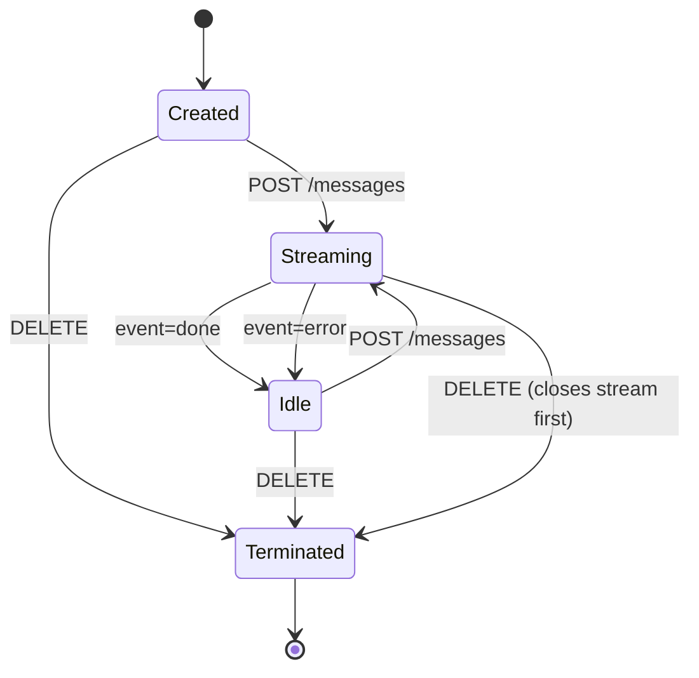

# HTTP API Contract

Companion for [`http_api_contract.als`](./http_api_contract.als). Models the
externally-observable behavior of a single conversation through june1815's HTTP
surface: which states a conversation can be in, which SSE event types may be
emitted in which state, and which terminal events end a stream.

## Conversation states

| State | Meaning |
| --- | --- |
| `Created` | The conversation exists but no turn has been started yet. |
| `Streaming` | A `POST /messages` is in progress; SSE events are flowing to the client. |
| `Idle` | The last turn has finished (with `done` or `error`). New turns may start. |
| `Terminated` | `DELETE /conversations/:id` was processed. The conversation is gone. Terminal. |

## Event types observable in each state

| Event | Allowed in |
| --- | --- |
| `TextDelta` | `Streaming` |
| `ReasoningDelta` | `Streaming` |
| `ToolUse` | `Streaming` |
| `Usage` | `Streaming` |
| `Interrupted` | `Streaming` only — emitted exactly once before `Done` |
| `Done` | `Streaming` (terminal for the stream; conversation moves to `Idle`) |
| `Error` | `Streaming` (terminal for the stream; conversation moves to `Idle`) |
| `Ping` | any state on the long-lived `/events` channel |

## Invariants verified

- **`streamingEndsInDoneOrError`** — Every `Streaming` segment ends with exactly one `Done` or `Error` event, never both, never neither.
- **`interruptedBeforeDone`** — If `Interrupted` is emitted in a stream, exactly one `Done` follows. The client always sees a clean close.
- **`noEventsAfterTerminated`** — Once the conversation is `Terminated`, no event can be observed for that conversation_id.
- **`usageCarriesNonNegative`** — `Done` events always carry usage with non-negative input/output token counts (encoded as a positivity flag in the Alloy model).
