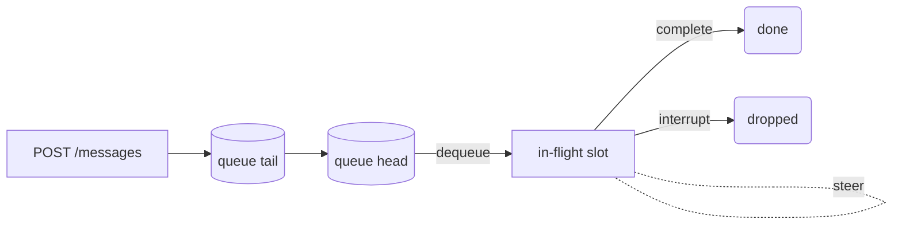

# Message Queue and Steering

Companion for [`message_queue.als`](./message_queue.als). Models the per-conversation
FIFO message queue and the steering/interrupt affordance.

## Contract

| Operation | Effect |
| --- | --- |
| `enqueue(m)` | Append `m` to the tail of the queue. |
| `dequeue` | Take the head of the queue and start a turn for it. The dequeued message becomes the **in-flight** message. |
| `steer(text)` | Replace the in-flight message with a steered variant. Does not consume any queued message; the operator is redirecting the current turn. |
| `complete` | Mark the in-flight turn as done; clear the in-flight slot. |
| `interrupt` | Abort the in-flight turn without dequeuing. The current in-flight message is dropped; the queue tail is preserved. |

## Invariants verified

- **`fifoOrdering`** — Within one conversation, messages are dequeued in the
  same order they were enqueued. Proves the API contract that
  `POST /messages` calls are serialized per conversation.
- **`steerNeverConsumes`** — A `steer` operation does not change the queue's
  contents, only the in-flight payload. Proves the operator cannot
  accidentally drop pending work by steering.
- **`everyEnqueuedEventuallyHandled`** — Under the assumption of progress
  (no infinite stutter), every enqueued message is either delivered to a turn
  or explicitly cancelled — it cannot be lost.
- **`atMostOneInFlight`** — At any moment, a conversation has zero or one
  in-flight messages, never two. Proves the implementation cannot accidentally
  start a second turn while one is running.

## State

