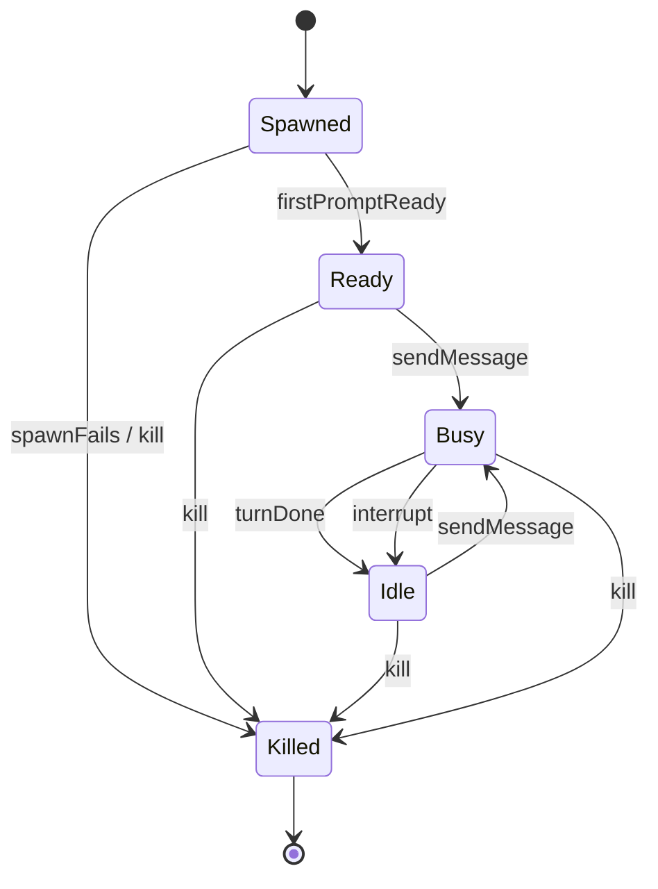

# Session Lifecycle

Companion for [`session_lifecycle.als`](./session_lifecycle.als). Models the
state machine of a single PTY-wrapped `claude` child process owned by one
conversation.

## Contract

| State | Meaning |
| --- | --- |
| `Spawned` | `node-pty` has forked the process; the TUI has not yet finished its splash. No input may be sent. |
| `Ready` | The TUI has reached its idle prompt. Messages may be sent. |
| `Busy` | A turn is in flight — the model is reasoning, emitting text, or running tools. |
| `Idle` | The turn has finished; the next message may be sent. Equivalent to `Ready` for subsequent turns. |
| `Killed` | The process has exited or been signalled. Terminal. |

## State machine

## Invariants verified

- **`noBusyBeforeReady`** — A session never transitions into `Busy` without
  having reached `Ready` at least once. Proves the server cannot accidentally
  send a message during PTY warm-up.
- **`killedIsTerminal`** — Once `Killed`, the session stays `Killed`. No
  zombie revival.
- **`interruptReachesIdle`** — Every `Busy → Idle` transition triggered by
  interrupt completes in one step. Proves the operator never waits unbounded
  time after pressing the interrupt button.

## Scenarios shown reachable

- `reachReady` — at least one trace reaches `Ready`.
- `reachBusy` — at least one trace reaches `Busy` (i.e. an end-to-end turn).
- `killAfterBusy` — `Busy → Killed` works (graceful kill mid-turn).
