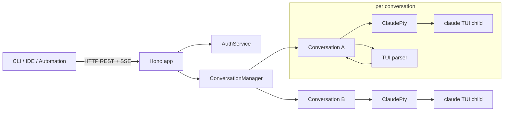
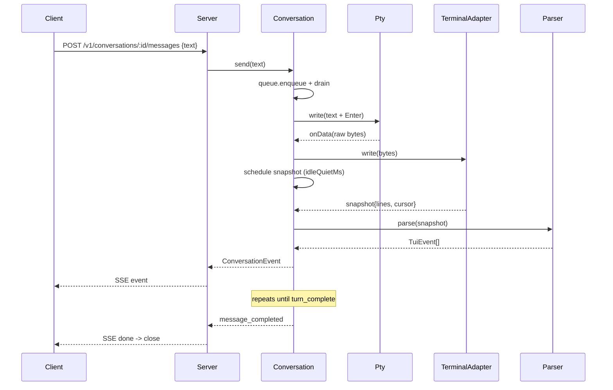

# Architecture

## Components

| Layer | Module | Responsibility |
| --- | --- | --- |
| Config | `src/config/` | zod schema + loader (CLI > ENV > YAML > defaults) |
| Claude | `src/claude/` | locate / install / version-probe / auth-detect the binary |
| PTY | `src/pty/` | spawn under node-pty, drive xterm-headless, parse TUI |
| Conversation | `src/conversation/` | one wrapper per conv: queue, lifecycle, session marker |
| Server | `src/server/` | Hono REST + SSE with bearer auth + request-id |
| CLI | `src/cli/` | commander entry, prompts, doctor, gogogo composition |

## Per-turn dataflow

## State machines

See the corresponding Alloy specs for executable verification:

- [Session lifecycle](../alloy/session_lifecycle.md) — Spawned → Ready → Busy → Idle → Killed.
- [Message queue](../alloy/message_queue.md) — FIFO + in-flight slot + steering.
- [Auth and config priority](../alloy/auth_config_priority.md) — total, deterministic, monotone.
- [HTTP API contract](../alloy/http_api_contract.md) — Created → Streaming → Idle → Terminated.

## Non-goals (v1)

- Web UI / dashboard.
- Multi-user authentication beyond bearer-token.
- Distributed deployment of conversations across machines.
- gRPC / WebSocket transport.
- Windows PTY support.
